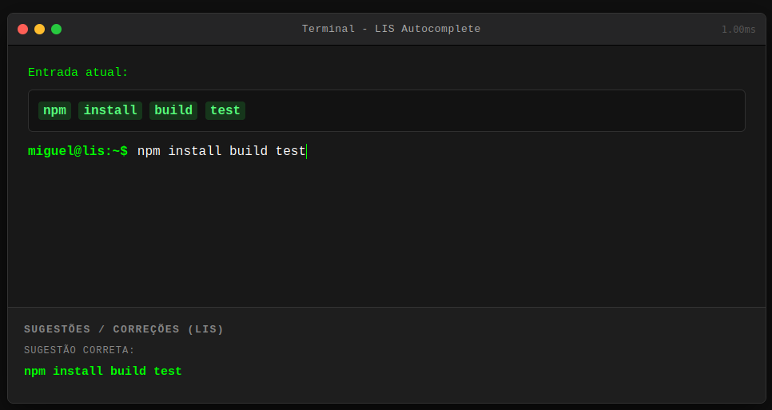
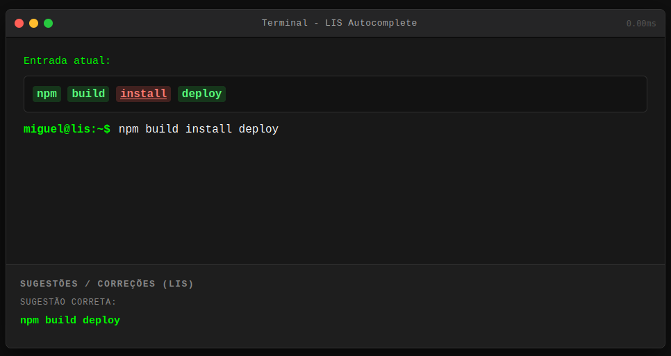
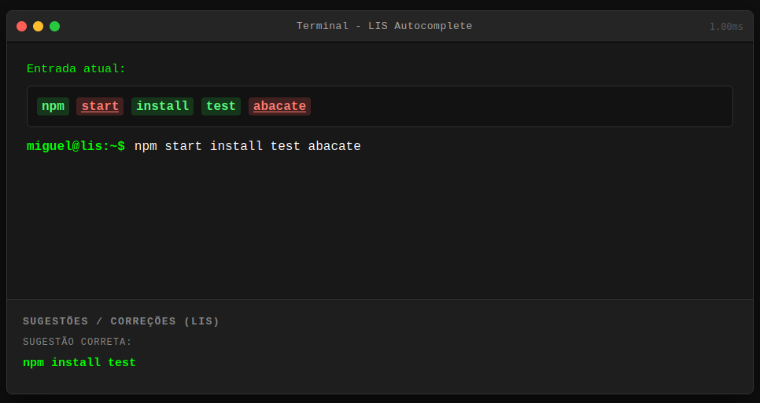

# 🖥️ Terminal LIS Autocomplete (Programação Dinâmica)

**Grupo:** G21_Programacao_Dinamica_PA-26.1  
**Conteúdo da Disciplina:** Programação Dinâmica

## Alunos   
| Matrícula | Aluno |
| -- | -- |
| 21/1062320 | [Miguel Arthur](https://github.com/zlimaz) |
| 21/1062796 | [Mariiana Siqueira Neris](https://github.com/Maryyscreuza) |

## Sobre 

Este projeto é uma aplicação web interativa que simula um terminal de comandos ou editor de texto minimalista. O objetivo do sistema é analisar a sequência de comandos digitados pelo usuário em tempo real, identificar a Maior Subsequência Crescente (LIS - Longest Increasing Subsequence) de elementos que seguem uma ordem ideal pré-definida e sugerir a correção mínima para os elementos que quebraram a sintaxe.

### Como funciona o algoritmo?

O núcleo do projeto é a implementação do algoritmo de Programação Dinâmica para encontrar a Maior Subsequência Crescente. O sistema possui um "gabarito" que define a ordem lógica ou estrutural correta esperada.

1. **Mapeamento:** As palavras digitadas pelo usuário (tokens) são convertidas em um array de índices numéricos com base no gabarito de referência.
2. **Programação Dinâmica (Bottom-Up):** O algoritmo preenche iterativamente uma tabela de tabulação (L[j]), calculando os comprimentos máximos das subsequências crescentes.
3. **Reconstrução da Solução:** Um vetor de predecessores (pre[j]) é utilizado no laço principal para permitir o rastreamento e a reconstrução exata dos elementos que estão na ordem correta.
4. **Correção Automática:** As palavras que ficaram fora da LIS são isoladas. A interface então sugere a remoção ou o reposicionamento desses itens visando corrigir o comando do usuário.

## Screenshots do Sistema e Testes

### 1. Teste de Validação (Caminho Feliz)
*Neste teste, o usuário digita os comandos na ordem exata definida pelo gabarito. O motor LIS processa a entrada e valida toda a sequência em verde, enquanto a telemetria (canto superior direito) indica o tempo de processamento da PD.*

### 2. Teste de Identificação (Quebra de Ordem)
*Aqui, a palavra "install" é digitada fora da sequência lógica. A Programação Dinâmica a identifica como uma quebra na Maior Subsequência Crescente (destacada em vermelho) e o painel de sugestões reconstrói o comando de forma limpa.*

### 3. Teste de Filtragem (Palavras Inexistentes/Intrusas)
*O usuário digita comandos não catalogados ("start", "abacate") no meio do pipeline. O corretor LIS filtra o ruído (em vermelho) e preserva apenas o que mantém a coerência estrutural da LIS.*

## Instalação 

O projeto foi construído puramente com tecnologias web nativas (HTML5, CSS3 Vanilla e JavaScript). Nenhuma biblioteca externa ou framework foi utilizado.
Portanto, não há necessidade de gerenciadores de dependências.

### Como executar

1. Clone o repositório para sua máquina local.
2. Navegue até o diretório principal do projeto.
3. Abra o arquivo `index.html` diretamente em qualquer navegador web moderno (Chrome, Firefox, Edge, Safari). Não é necessário iniciar um servidor local.

## Uso 

1. **Digitação de Comandos:** Acesse a linha de input do terminal e comece a digitar uma sequência de instruções lógicas.
2. **Análise em Tempo Real:** O sistema processará a entrada a cada tecla digitada (eventos de input/keyup), tokenizando o texto e submetendo-o ao motor LIS.
3. **Leitura do Painel:** Observe o painel inferior de Sugestões/Correções. O sistema indicará a estrutura válida detectada e detalhará as correções para os elementos inseridos fora da ordem esperada.

## Vídeo de apresentação

